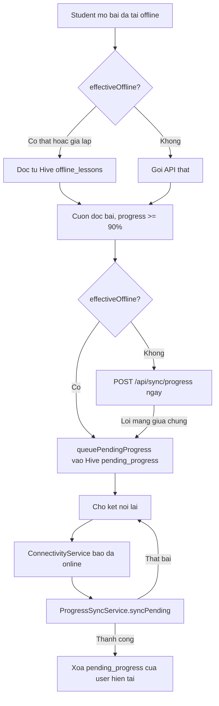

# Offline Flow (TV3)

Owner: TV3. Covers `lib/features/offline`, `lib/features/formula_simulation`,
`lib/core/storage`, and `backend/src/modules/offline-sync` (see
`docs/MODULE_OWNERSHIP.md`).

## Goal

A student can download a lesson, read it and use its formula simulation
without a network connection, and any reading progress recorded while
offline reaches the server once the device is back online.

## Components

- `ConnectivityService` (`lib/features/offline/services/connectivity_service.dart`)
  wraps `connectivity_plus` and exposes `isOnline()` + `onStatusChange`.
  Defensive by design: platform-channel failures (e.g. `flutter_test`,
  which has no connectivity plugin registered) are swallowed and treated
  as "online" instead of crashing.
- `AppState.effectiveOffline` = `simulateOffline` (the manual "airplane
  mode" switch in `shared/widgets/app_scaffold.dart`, used for demos) OR
  `isOffline` (real network status). Both trigger the same offline code
  paths so a real network drop behaves exactly like the demo toggle.
- `LocalStorageService` (`lib/core/storage/local_storage_service.dart`)
  owns four Hive boxes:
  - `offline_lessons` — user-scoped full lesson JSON, written by
    `AppState.downloadLesson`.
  - `pending_progress` — queued progress updates not yet sent to the
    server, keyed by `<userId>::<lessonId>` (only the latest update per
    user/lesson pair is kept).
  - `practice_questions` — user-scoped Practice question cache, keyed by
    `<userId>::<lessonId>`, including `correctOption`, `explanation`, `hint`,
    and `isOfflineEnabled` so Practice can be graded fully offline.
  - `pending_practice_sync` — queued Practice sessions not yet sent to the
    server, keyed by `<userId>::<lessonId>::<sessionId>` because students can
    repeat Practice many times for the same lesson.
- `ProgressSyncService` (`lib/features/offline/services/progress_sync_service.dart`)
  flushes the authenticated user's `pending_progress` to
  `POST /api/sync/progress` (`backend/src/modules/offline-sync`) and clears
  only the matching snapshot on success.
- `PracticeSyncService` (`lib/features/offline/services/practice_sync_service.dart`)
  flushes `pending_practice_sync` grouped by lesson to
  `POST /api/lessons/{lessonId}/practice-sessions/sync`. The backend is
  idempotent by client-generated session id, calculates coins/badges there,
  and does not update Quiz progress fields.

## Flow

Practice uses the same reconnect trigger. When a downloaded lesson includes
Practice questions, the student can open `/practice/{lessonId}` offline,
answer locally, see the correct answer/explanation immediately, and queue a
completed session in `pending_practice_sync`. On reconnect the app syncs the
batch to the Practice endpoint and clears only accepted session snapshots.

`AppState` also runs `ProgressSyncService.syncPending()` once at
`bootstrap()` if the app starts online with a non-empty queue, so items
queued from a previous offline session are not stuck until the next live
connectivity transition.

## Known limitations (MVP)

- `pending_progress` only keeps the latest update per user/lesson pair
  (keyed by `<userId>::<lessonId>`); intermediate values in between are not
  preserved.
- Quiz submission (`AppState.submitQuiz`, `POST /api/quiz/submit`) is
  **not** queued by this flow: grading requires the correct answers,
  which the client never receives — `GET /api/lessons/{id}/questions`
  explicitly strips `correctOption`/`explanation` (see
  `docs/API_CONTRACT.md`). Taking and submitting a quiz still requires a
  live network connection; only *reading progress* is queued while
  offline.
- Practice is separate from Quiz: `GET /api/lessons/{id}/practice-questions`
  intentionally returns answers/hints for offline cache, uses
  `practice_questions` instead of `questions`, and syncing sessions does not
  write `progress.latest_quiz_score`, `progress.best_quiz_score`, or lesson
  completion.
- Sync is best-effort and whole-batch: if the server rejects the batch,
  every item stays queued and is retried on the next reconnect. There is
  no per-item retry or conflict-resolution UI yet — the backend already
  returns a `conflicts` field in the response for this
  (`offline-sync.service.ts`), currently unused by the client. Tracked as
  a P2 follow-up in the TV3 development plan.
- `simulateOffline` (the manual toggle in the app bar) is kept as-is for
  demo purposes; it is OR-ed with the real `isOffline` flag rather than
  replaced by it.
- Downloading a lesson now also calls `POST /api/sync/downloads`
  (best-effort, does not block or fail the local download) so
  `downloaded_lessons` reflects real usage for Admin statistics. Downloading
  a whole chapter (`AppState.downloadChapter`) simply calls
  `downloadLesson` once per lesson in the chapter.
- The Offline Downloads screen shows a sync-status banner
  (`pendingSyncCount` / "Đồng bộ ngay" button) and an approximate cached
  size per lesson (`estimatedOfflineSizeBytes`, based on re-encoding the
  cached JSON — not the actual bytes on disk).
- Legacy offline/progress entries without `userId` are not treated as owned
  by the current user. Legacy pending progress is not synced automatically.
  See `docs/TV3_MULTI_USER_OFFLINE.md`.

## Manual test steps ("test mất mạng")

1. Login, open a lesson, tap the download icon in the app bar.
2. Turn on airplane mode on the device/emulator (or use the in-app
   "simulate offline" switch if testing somewhere airplane mode is
   impractical, e.g. a desktop debug run).
3. Reopen the same lesson: the Markdown content, LaTeX formula and the
   slider simulation widget must all render from the local Hive cache
   (`OfflineLesson` route in `docs/API_CONTRACT.md`'s spirit — no network
   call should be attempted).
4. Scroll to the end of the lesson so the reading progress bar reaches
   100%. This queues a reading-progress update locally; no network call
   happens while offline.
5. Turn the network back on (or flip the switch off). Within a few
   seconds `ProgressSyncService.syncPending()` runs automatically and the
   queued update should reach `POST /api/sync/progress` — verify via
   backend logs or by calling `GET /api/progress/me` afterwards.

Automated coverage: `test/offline_sync_test.dart` (unit tests for the
pending-progress queue and `ProgressSyncService`; does not require a
device/emulator).
