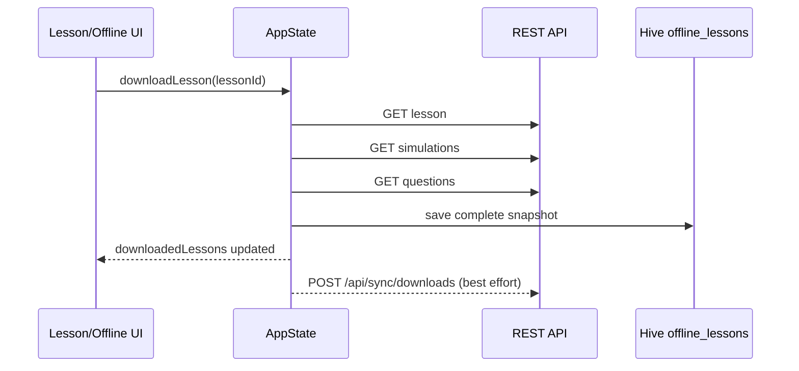
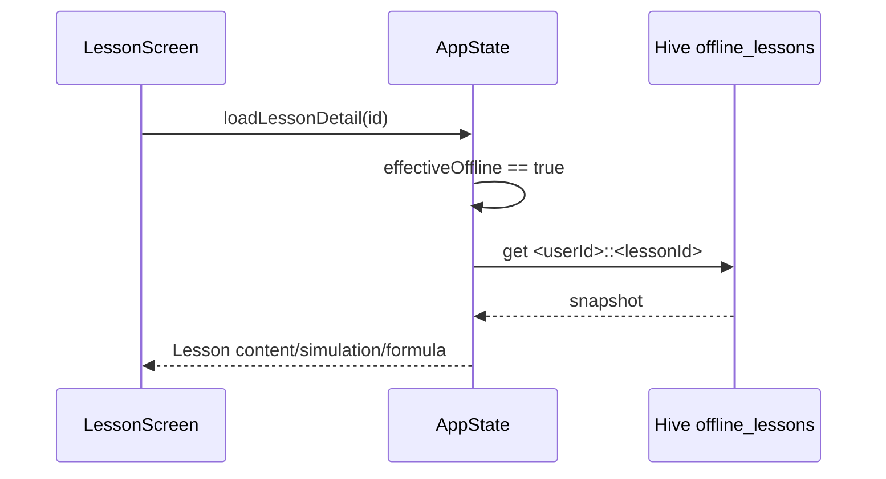
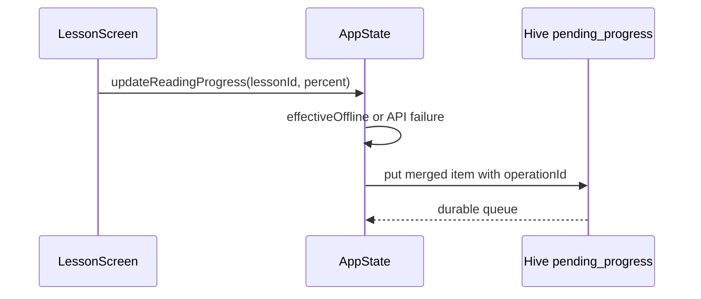
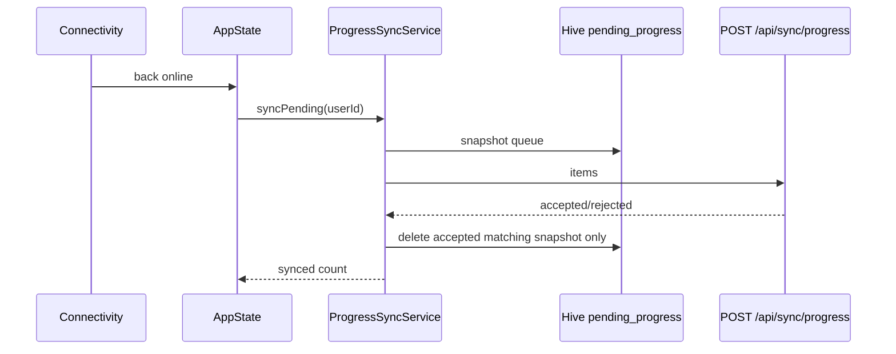
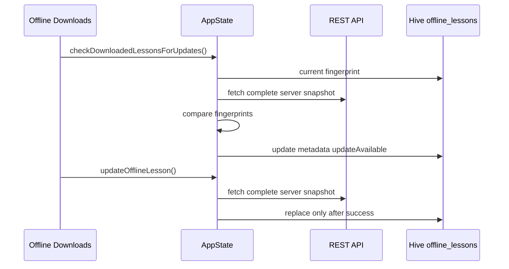
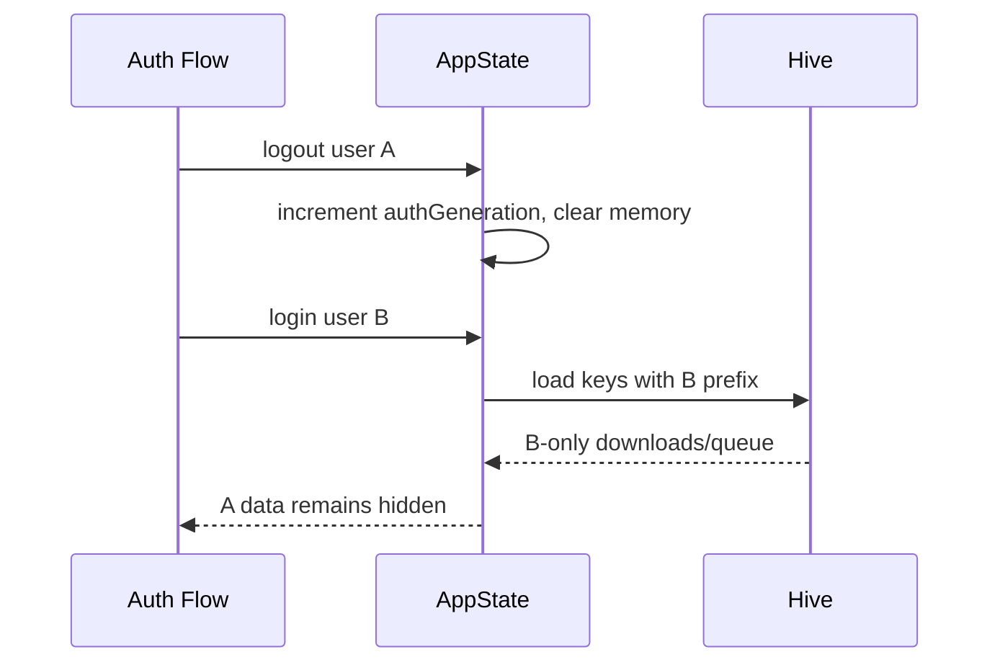

# Offline Sync Architecture

## Overview

The MVP offline architecture follows:

Flutter UI -> `AppState` -> offline/progress services -> Hive or REST API -> NestJS backend -> PostgreSQL.

Hive boxes:

- `offline_lessons`: complete lesson snapshots for offline reading.
- `pending_progress`: durable reading-progress queue.

Keys are scoped as `<userId>::<lessonId>`.

## Local Data Schema

Offline lesson snapshot:

- `userId`, `lessonId`
- `lesson`: title, chapter, content Markdown, formula LaTeX, simulation config, public questions, estimated minutes, timestamps
- `metadata`: `contentFingerprint`, `downloadedAt`, `lastCheckedAt`, `serverUpdatedAt`, `updateAvailable`

Pending progress item:

- `userId`, `lessonId`
- `progressPercent`, `isCompleted`
- `clientUpdatedAt`
- `operationId`
- `createdAt`, `retryCount`, `lastError`, `nextRetryAt`

## Conflict Policy

- Reading progress is monotonic: lower values do not replace higher values locally or on the server.
- `COMPLETED` status is preserved once reached.
- Latest queued progress per user/lesson replaces older lower progress.
- Partial backend failures keep rejected items in Hive.

## Retry Policy

Sync uses a per-user single-flight guard. Failed request snapshots stay queued and receive retry metadata. Auto sync is triggered on bootstrap when online and on reconnect. Manual sync is available from Offline Downloads.

## Security

The backend ignores any client-supplied `userId` and uses JWT identity from `AuthGuard`. Offline Hive keys use backend user id, never email/password/token.

Quiz offline is intentionally disabled for MVP to avoid storing answer material or answer-checking logic locally.

## Diagrams

### Download Lesson

### Read Lesson Offline

### Offline Progress Queue

### Reconnect And Sync

### Cache Version Update

### Account Switching

