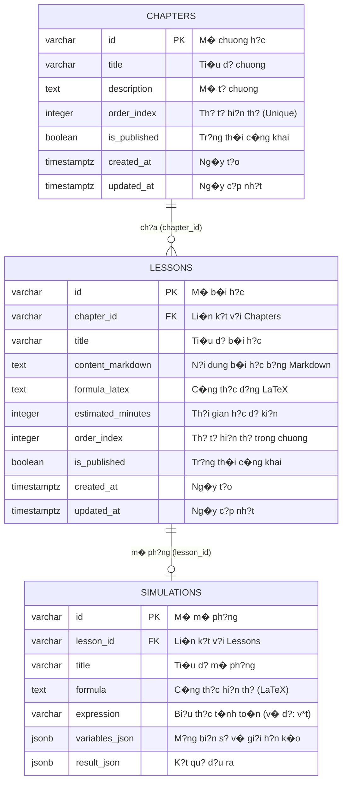

# B�o c�o Deliverables c?a Th�nh vi�n 2 (TV2) - Learning Content

T�i li?u n�y t?ng h?p to�n b? c�c ph?n vi?c d� du?c code v� tri?n khai th�nh c�ng cho **Th�nh vi�n 2 (TV2)** ph? tr�ch module **Learning Content (Chapters, Lessons, Simulations)** bao g?m ERD, co s? d? li?u, API Backend (NestJS), d? li?u m?u (Seed Data) v� Giao di?n Frontend (Flutter).

---

## 1. So d? th?c th? quan h? (ERD) - Ph?n Content

Du?i d�y l� so d? quan h? gi?a c�c b?ng thu?c ph?m vi qu?n l� c?a TV2:

---

## 2. Ph?n Co s? d? li?u & D? li?u m?u (Database & Seed)

### A. SQL Schema (B?ng d? li?u)
�?nh nghia b?ng trong [schema.sql](file:///c:/Users/MSILap/Desktop/New%20folder/X-Physics/backend/src/database/schema.sql):
* **B?ng Chapters:** Luu tr? c�c chuong l?n (v� d?: Chuy?n d?ng co h?c, L?c v� �p su?t, �i?n h?c).
* **B?ng Lessons:** Luu tr? chi ti?t b�i h?c du?i d?ng Markdown h? tr? c�ng th?c LaTeX.
* **B?ng Simulations:** Luu c?u h�nh m� ph?ng c�ng th?c d?ng (d?i tru?t slider).

### B. D? li?u m?u (Seed Data)
D? li?u m?u n?m trong thu m?c [seed-data/](file:///c:/Users/MSILap/Desktop/New%20folder/X-Physics/seed-data) v� du?c t? d?ng n?p qua [seed.ts](file:///c:/Users/MSILap/Desktop/New%20folder/X-Physics/backend/src/database/seed.ts):
* **Chuong h?c:** [chapters.json](file:///c:/Users/MSILap/Desktop/New%20folder/X-Physics/seed-data/chapters.json)
* **B�i h?c:** [lessons.json](file:///c:/Users/MSILap/Desktop/New%20folder/X-Physics/seed-data/lessons.json)
* **M� ph?ng:** [simulations.json](file:///c:/Users/MSILap/Desktop/New%20folder/X-Physics/seed-data/simulations.json)

---

## 3. API Backend (NestJS)

Module Backend c?a TV2 d� du?c ho�n thi?n c?u tr�c g?m:

### A. C?u tr�c thu m?c
* Chapters Module: [backend/src/modules/chapters/](file:///c:/Users/MSILap/Desktop/New%20folder/X-Physics/backend/src/modules/chapters)
* Lessons Module: [backend/src/modules/lessons/](file:///c:/Users/MSILap/Desktop/New%20folder/X-Physics/backend/src/modules/lessons)
* Simulations Module: [backend/src/modules/simulations/](file:///c:/Users/MSILap/Desktop/New%20folder/X-Physics/backend/src/modules/simulations)

### B. Endpoints API
C�c Controller d?nh nghia c�c API sau:
1. **L?y danh s�ch chuong:** `GET /api/chapters`
2. **L?y chi ti?t chuong:** `GET /api/chapters/:id`
3. **L?y danh s�ch b�i h?c thu?c chuong:** `GET /api/chapters/:id/lessons`
4. **L?y chi ti?t b�i h?c:** `GET /api/lessons/:id`
5. **L?y m� ph?ng c?a b�i h?c:** `GET /api/lessons/:id/simulations`

---

## 4. Giao di?n Frontend (Flutter)

Giao di?n h?c t?p (UX/UI) c?a TV2 du?c tri?n khai qua c�c m�n h�nh v� widget sau:

### A. Home Dashboard (Danh s�ch chuong h?c)
* **File:** [home_screen.dart](file:///c:/Users/MSILap/Desktop/New%20folder/X-Physics/lib/features/home/screens/home_screen.dart)
* **Ch?c nang:** Hi?n th? l?i ch�o c� nh�n h�a, t?ng s? xu dang c�, danh s�ch c�c chuong h?c du?i d?ng th? Card v?i m�u s?c d?c trung, hi?n th? thanh ph?n tram ti?n tr�nh ho�n th�nh c?a t?ng chuong.

### B. Chapter Detail (Danh s�ch b�i h?c)
* **File:** [chapter_detail_screen.dart](file:///c:/Users/MSILap/Desktop/New%20folder/X-Physics/lib/features/chapters/screens/chapter_detail_screen.dart)
* **Ch?c nang:** Hi?n th? danh s�ch c�c b�i h?c tuong ?ng v?i chuong d� ch?n. C�c b�i h?c d� ho�n th�nh s? hi?n th? d?u check m�u xanh.

### C. Lesson Detail Shell (Chi ti?t b�i h?c)
* **File:** [lesson_screen.dart](file:///c:/Users/MSILap/Desktop/New%20folder/X-Physics/lib/features/lessons/screens/lesson_screen.dart)
* **Ch?c nang:**
  * Hi?n th? thanh ti?n tr�nh d?c b�i (progress bar ? d?u trang).
  * Render n?i dung b�i h?c b?ng d?nh d?ng Markdown th�ng qua widget `MarkdownBody`.
  * Hi?n th? c�c c�ng th?c v?t l� ch�nh b?ng LaTeX th�ng qua thu vi?n `flutter_math_fork`.
  * Nh�ng widget m� ph?ng c�ng th?c v� n�t chuy?n sang l�m b�i t?p tr?c nghi?m (Quiz).

### D. Interactive Formula Simulation Widget (M� ph?ng c�ng th?c)
* **File:** [formula_simulation_widget.dart](file:///c:/Users/MSILap/Desktop/New%20folder/X-Physics/lib/features/lessons/widgets/formula_simulation_widget.dart)
* **Ch?c nang:** Cho ph�p h?c sinh tuong t�c tr?c ti?p v?i c�ng th?c b?ng c�ch thay d?i gi� tr? c?a c�c bi?n qua thanh tru?t `Slider` (v� d?: k�o thay d?i v?n t?c $v$, th?i gian $t$) v� k?t qu? t�nh to�n (qu�ng du?ng $s = v \times t$) s? l?p t?c thay d?i d?ng tr�n m�n h�nh.
