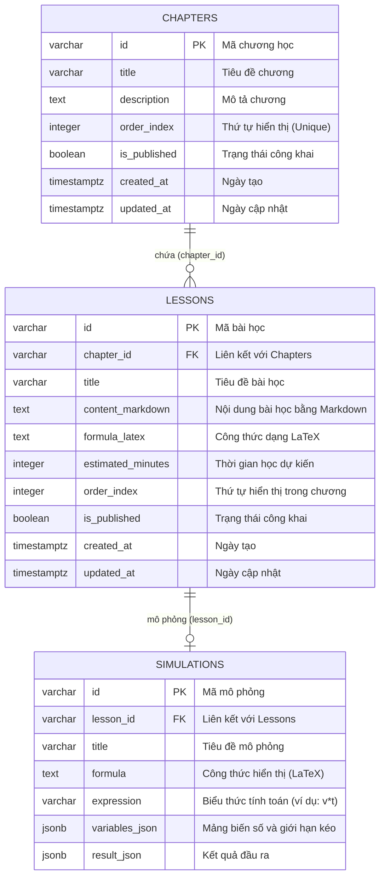

# Báo cáo Deliverables của Thành viên 2 (TV2) - Learning Content

Tài liệu này tổng hợp toàn bộ các phần việc đã được code và triển khai thành công cho **Thành viên 2 (TV2)** phụ trách module **Learning Content (Chapters, Lessons, Simulations)** bao gồm ERD, cơ sở dữ liệu, API Backend (NestJS), dữ liệu mẫu (Seed Data) và Giao diện Frontend (Flutter).

---

## 1. Sơ đồ thực thể quan hệ (ERD) - Phần Content

Dưới đây là sơ đồ quan hệ giữa các bảng thuộc phạm vi quản lý của TV2:

---

## 2. Phần Cơ sở dữ liệu & Dữ liệu mẫu (Database & Seed)

### A. SQL Schema (Bảng dữ liệu)
Định nghĩa bảng trong [schema.sql](file:///c:/Users/MSILap/Desktop/New%20folder/X-Physics/backend/src/database/schema.sql):
* **Bảng Chapters:** Lưu trữ các chương lớn (ví dụ: Chuyển động cơ học, Lực và áp suất, Điện học).
* **Bảng Lessons:** Lưu trữ chi tiết bài học dưới dạng Markdown hỗ trợ công thức LaTeX.
* **Bảng Simulations:** Lưu cấu hình mô phỏng công thức động (dải trượt slider).

### B. Dữ liệu mẫu (Seed Data)
Dữ liệu mẫu nằm trong thư mục [seed-data/](file:///c:/Users/MSILap/Desktop/New%20folder/X-Physics/seed-data) và được tự động nạp qua [seed.ts](file:///c:/Users/MSILap/Desktop/New%20folder/X-Physics/backend/src/database/seed.ts):
* **Chương học:** [chapters.json](file:///c:/Users/MSILap/Desktop/New%20folder/X-Physics/seed-data/chapters.json)
* **Bài học:** [lessons.json](file:///c:/Users/MSILap/Desktop/New%20folder/X-Physics/seed-data/lessons.json)
* **Mô phỏng:** [simulations.json](file:///c:/Users/MSILap/Desktop/New%20folder/X-Physics/seed-data/simulations.json)

---

## 3. API Backend (NestJS)

Module Backend của TV2 đã được hoàn thiện cấu trúc gồm:

### A. Cấu trúc thư mục
* Chapters Module: [backend/src/modules/chapters/](file:///c:/Users/MSILap/Desktop/New%20folder/X-Physics/backend/src/modules/chapters)
* Lessons Module: [backend/src/modules/lessons/](file:///c:/Users/MSILap/Desktop/New%20folder/X-Physics/backend/src/modules/lessons)
* Simulations Module: [backend/src/modules/simulations/](file:///c:/Users/MSILap/Desktop/New%20folder/X-Physics/backend/src/modules/simulations)

### B. Endpoints API
Các Controller định nghĩa các API sau:
1. **Lấy danh sách chương:** `GET /api/chapters`
2. **Lấy chi tiết chương:** `GET /api/chapters/:id`
3. **Lấy danh sách bài học thuộc chương:** `GET /api/chapters/:id/lessons`
4. **Lấy chi tiết bài học:** `GET /api/lessons/:id`
5. **Lấy mô phỏng của bài học:** `GET /api/lessons/:id/simulations`

---

## 4. Giao diện Frontend (Flutter)

Giao diện học tập (UX/UI) của TV2 được triển khai qua các màn hình và widget sau:

### A. Home Dashboard (Danh sách chương học)
* **File:** [home_screen.dart](file:///c:/Users/MSILap/Desktop/New%20folder/X-Physics/lib/features/home/screens/home_screen.dart)
* **Chức năng:** Hiển thị lời chào cá nhân hóa, tổng số xu đang có, danh sách các chương học dưới dạng thẻ Card với màu sắc đặc trưng, hiển thị thanh phần trăm tiến trình hoàn thành của từng chương.

### B. Chapter Detail (Danh sách bài học)
* **File:** [chapter_detail_screen.dart](file:///c:/Users/MSILap/Desktop/New%20folder/X-Physics/lib/features/chapters/screens/chapter_detail_screen.dart)
* **Chức năng:** Hiển thị danh sách các bài học tương ứng với chương đã chọn. Các bài học đã hoàn thành sẽ hiển thị dấu check màu xanh.

### C. Lesson Detail Shell (Chi tiết bài học)
* **File:** [lesson_screen.dart](file:///c:/Users/MSILap/Desktop/New%20folder/X-Physics/lib/features/lessons/screens/lesson_screen.dart)
* **Chức năng:**
  * Hiển thị thanh tiến trình đọc bài (progress bar ở đầu trang).
  * Render nội dung bài học bằng định dạng Markdown thông qua widget `MarkdownBody`.
  * Hiển thị các công thức vật lí chính bằng LaTeX thông qua thư viện `flutter_math_fork`.
  * Nhúng widget mô phỏng công thức và nút chuyển sang làm bài tập trắc nghiệm (Quiz).

### D. Interactive Formula Simulation Widget (Mô phỏng công thức)
* **File:** [formula_simulation_widget.dart](file:///c:/Users/MSILap/Desktop/New%20folder/X-Physics/lib/features/lessons/widgets/formula_simulation_widget.dart)
* **Chức năng:** Cho phép học sinh tương tác trực tiếp với công thức bằng cách thay đổi giá trị của các biến qua thanh trượt `Slider` (ví dụ: kéo thay đổi vận tốc $v$, thời gian $t$) và kết quả tính toán (quãng đường $s = v \times t$) sẽ lập tức thay đổi động trên màn hình.
